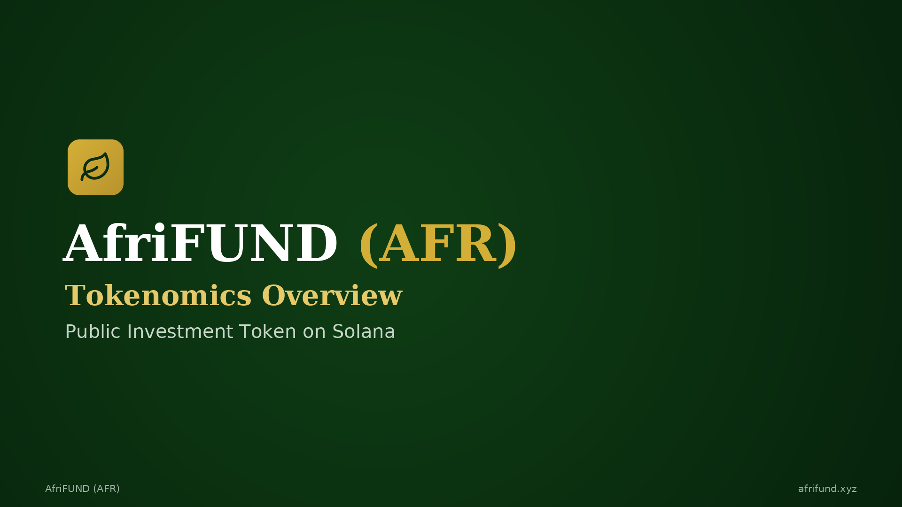

# Welcome to AfriFUND

**AfriFUND (AFR)** is a public investment token on **Solana** that funds real
infrastructure in East Africa and shares project profits with token holders.

## Explore

| Section | What's inside |
| --- | --- |
| 🪙 [**Tokenomics**](tokenomics/README.md) | Supply, presale, use of funds, dividends, vesting, fees, contract |
| 🤝 [**Ambassador Program**](ambassador/README.md) | Unilevel rewards, bonus pool, earning scenarios, requirements |
| 📚 [**Documentation**](docs/README.md) | Introduction, how it works, FAQ |
| 🗺️ [**Roadmap**](roadmap/README.md) | Project phases and milestones |

## Quick facts

* **Network:** Solana · **Standard:** SPL
* **Total supply:** 10,000,000,000 AFR
* **Audited by:** SolidProof
* **Website:** [afrifund.xyz](https://afrifund.xyz)
