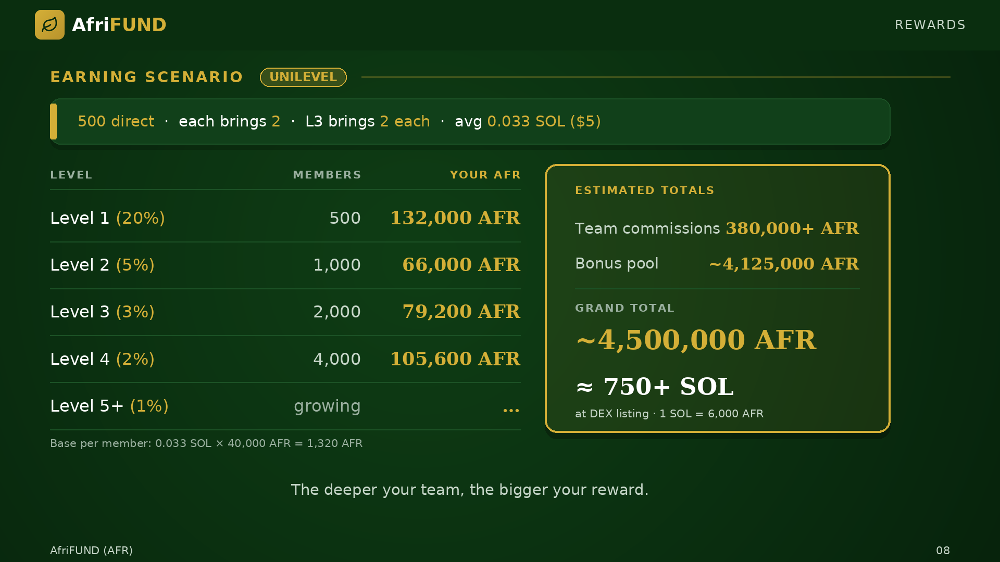

# Earning Scenario (Unilevel)

500 direct referrals · each brings 2 more · L3 brings 2 each · avg 0.033 SOL ($5).
Base per member: 0.033 SOL × 40,000 AFR = **1,320 AFR**.

| Level | Members | Rate | Your AFR |
| --- | --- | --- | --- |
| Level 1 | 500 | 20% | 132,000 AFR |
| Level 2 | 1,000 | 5% | 66,000 AFR |
| Level 3 | 2,000 | 3% | 79,200 AFR |
| Level 4 | 4,000 | 2% | 105,600 AFR |
| Level 5+ | growing | 1% | grows endlessly |

* Team commissions: **380,000+ AFR**
* Bonus Pool share: **~4,125,000 AFR**
* **Total: ~4,500,000 AFR** → at DEX listing (1 SOL = 6,000 AFR) ≈ **750+ SOL**

