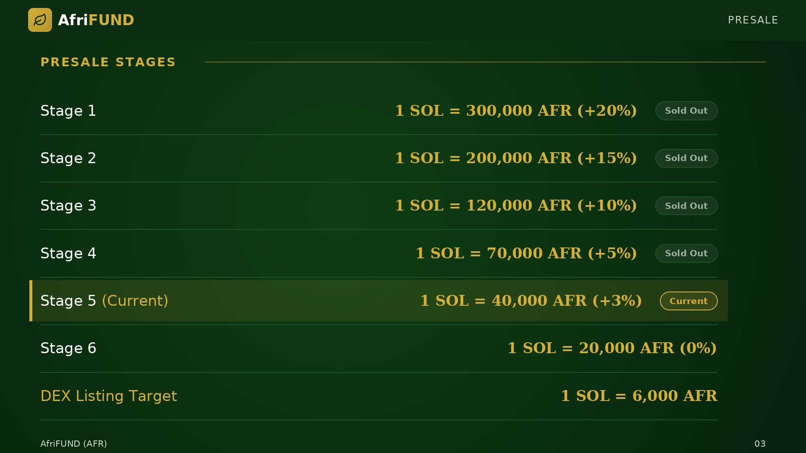

# Presale Stages

The six presale stages and the DEX listing target, showing how the SOL/AFR rate
changes over time. **Ambassadors earn rewards based on the stage at which their
referrals purchase**, so earlier invitations generate higher token amounts.

| Stage | Rate | Bonus | Status |
| --- | --- | --- | --- |
| Stage 1 | 1 SOL = 300,000 AFR | +20% | Sold Out |
| Stage 2 | 1 SOL = 200,000 AFR | +15% | Sold Out |
| Stage 3 | 1 SOL = 120,000 AFR | +10% | Sold Out |
| Stage 4 | 1 SOL = 70,000 AFR | +5% | Sold Out |
| **Stage 5 (Current)** | **1 SOL = 40,000 AFR** | **+3%** | **Active** |
| Stage 6 | 1 SOL = 20,000 AFR | 0% | Upcoming |
| DEX Listing Target | 1 SOL = 6,000 AFR | — | — |

> The earlier your referrals buy, the more AFR they receive per SOL — and the
> larger your 20% commission.

