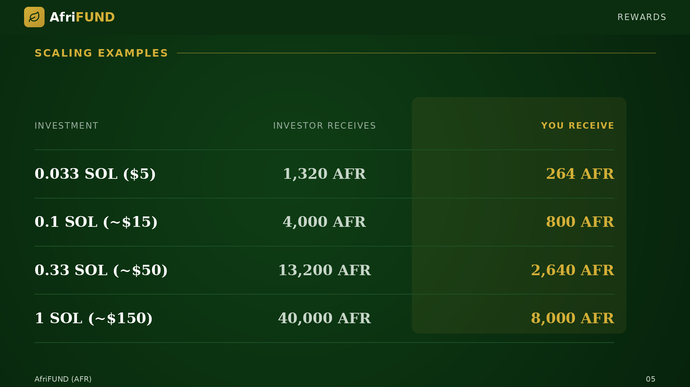

# Scaling Examples

| Investment | Investor receives | You receive |
| --- | --- | --- |
| 0.033 SOL ($5) | 1,320 AFR | 264 AFR |
| 0.1 SOL (~$15) | 4,000 AFR | 800 AFR |
| 0.33 SOL (~$50) | 13,200 AFR | 2,640 AFR |
| 1 SOL (~$150) | 40,000 AFR | 8,000 AFR |

