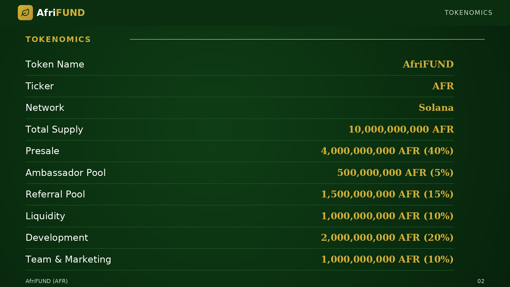

# Tokenomics Overview

High-level breakdown of the **10,000,000,000 AFR** supply, highlighting the
allocations most relevant to ambassadors: the **Referral Reward Pool**
(1,500,000,000 AFR) funds your unilevel commissions, and the **Ambassador Bonus
Pool** (500,000,000 AFR) is shared among ambassadors with 500+ active team
members. Together these reserve 20% of the supply to reward community growth. All
figures are fixed on-chain.

