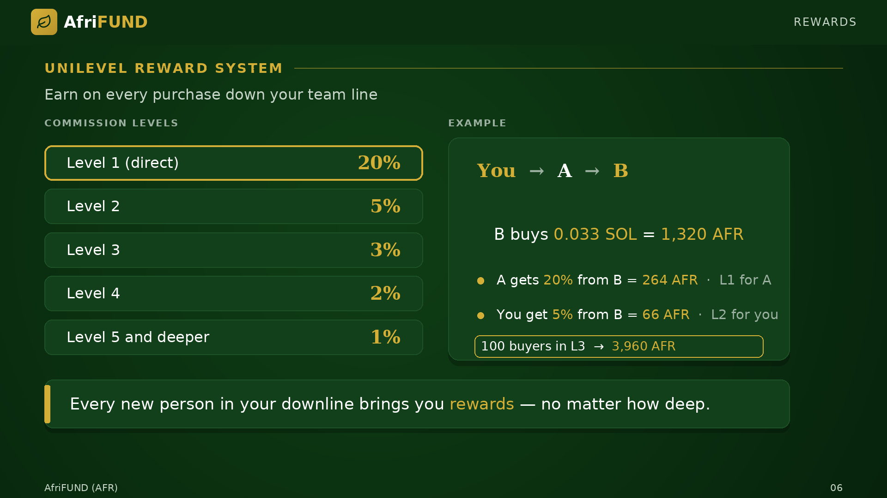

# Unilevel Reward System

Earn on **every purchase down your team line** — no matter how deep.

| Level | Commission |
| --- | --- |
| Level 1 (direct) | 20% |
| Level 2 | 5% |
| Level 3 | 3% |
| Level 4 | 2% |
| Level 5 and deeper | 1% |

**Example:** You invite A. A invites B. B buys 0.033 SOL → 1,320 AFR.
A gets 20% = **264 AFR**, you get 5% = **66 AFR**. With 100 buyers in Level 3:
`100 × 1,320 × 3% = 3,960 AFR`.

