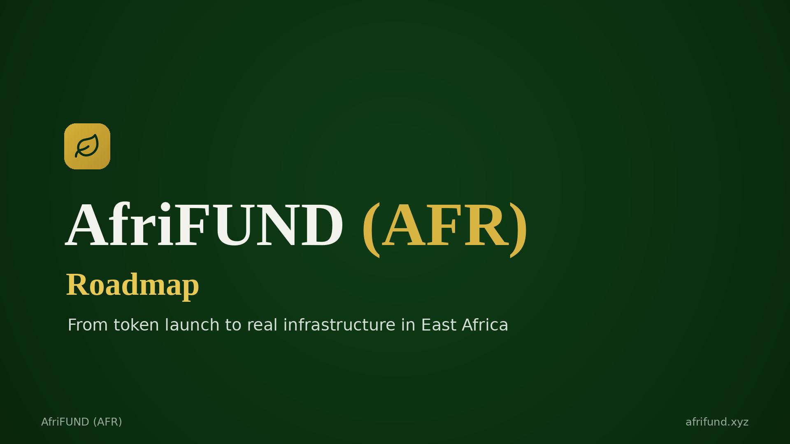

# Roadmap

From token launch to real infrastructure in East Africa. The AfriFUND roadmap
runs from the completed foundation work, through public presale, DEX listing with
the first projects, pan-African expansion, and on to a fully decentralized DAO.

| Quarter | Phase | Status |
| --- | --- | --- |
| [Q2 2026](q2-2026.md) | Foundation | ✅ Completed |
| [Q3 2026](q3-2026.md) | Public Presale | 🔄 Current |
| [Q4 2026](q4-2026.md) | DEX Listing & First Projects | ⏳ Upcoming |
| [Q1 2027](q1-2027.md) | Expansion | ⏳ Upcoming |
| [Q2 2027 & Beyond](q2-2027.md) | Decentralization | ⏳ Upcoming |

### In this section

* [Q2 2026 — Foundation](q2-2026.md)
* [Q3 2026 — Public Presale](q3-2026.md)
* [Q4 2026 — DEX Listing & First Projects](q4-2026.md)
* [Q1 2027 — Expansion](q1-2027.md)
* [Q2 2027 & Beyond — Decentralization](q2-2027.md)
