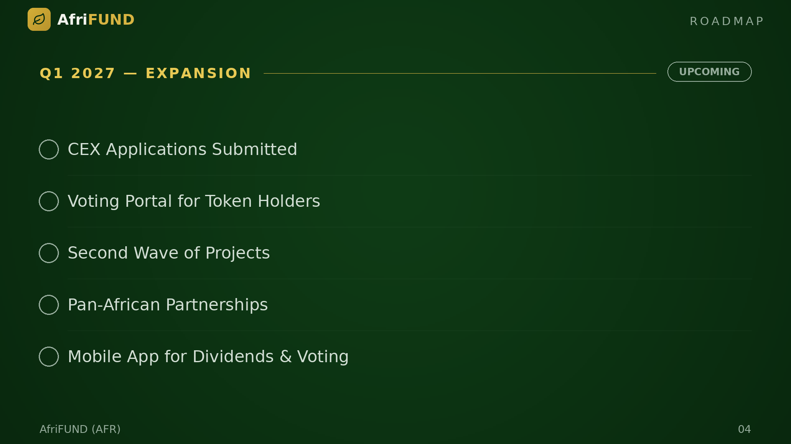

# Q1 2027 — Expansion

**Status: ⏳ Upcoming**

AfriFUND applies for centralized exchange listings. A governance voting portal
empowers the community to select future projects. A second wave of infrastructure
begins. Partnerships with Kenya, Tanzania, and Rwanda extend the model across East
Africa. A mobile app launches for tracking dividends and voting.

* ⏳ CEX Applications Submitted
* ⏳ Voting Portal for Token Holders
* ⏳ Second Wave of Projects
* ⏳ Pan-African Partnerships
* ⏳ Mobile App for Dividends & Voting

