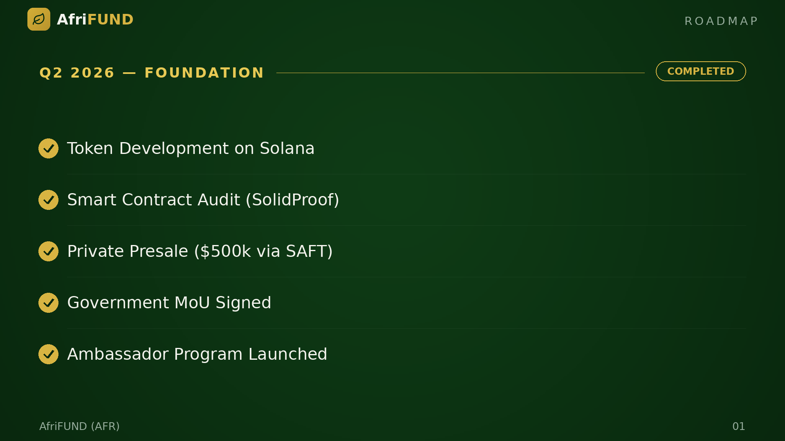

# Q2 2026 — Foundation

**Status: ✅ Completed**

The project was born. AfriFUND was developed as an SPL token on Solana and audited
by SolidProof. A private presale raised $500k through SAFT agreements with
strategic African funds. The Memorandum of Understanding with Uganda's Ministry of
Finance was signed, and the Ambassador Program onboarded its first promoters.

