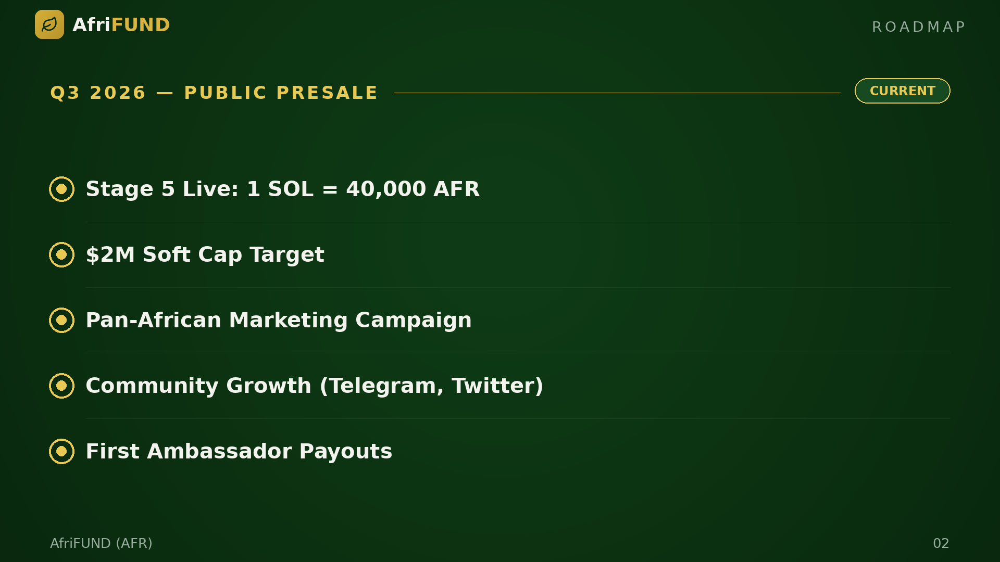

# Q3 2026 — Public Presale (Current)

**Status: 🔄 Current**

The public presale is live at Stage 5 with a rate of 1 SOL = 40,000 AFR. The
community is approaching the $2M soft cap. A continent-wide marketing push is
underway, led by ambassadors across Uganda, Kenya, Nigeria, and Ghana. Early
ambassadors are receiving their first rewards.

* 🔄 Stage 5 Live: 1 SOL = 40,000 AFR
* 🔄 $2M Soft Cap Target
* 🔄 Pan-African Marketing Campaign
* 🔄 Community Growth (Telegram, Twitter)
* 🔄 First Ambassador Payouts

