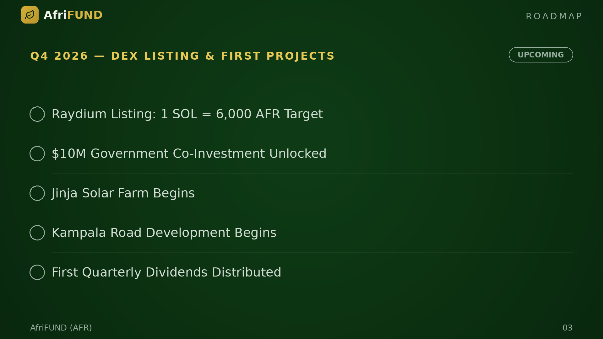

# Q4 2026 — DEX Listing & First Projects

**Status: ⏳ Upcoming**

The presale concludes and AFR lists on Raydium with a target rate of 6,000 AFR per
SOL. Uganda's $10M co-investment is released. Construction starts on the Jinja
Solar Farm and Kampala Road Development. The first quarterly dividends are
distributed to all AFR holders.

