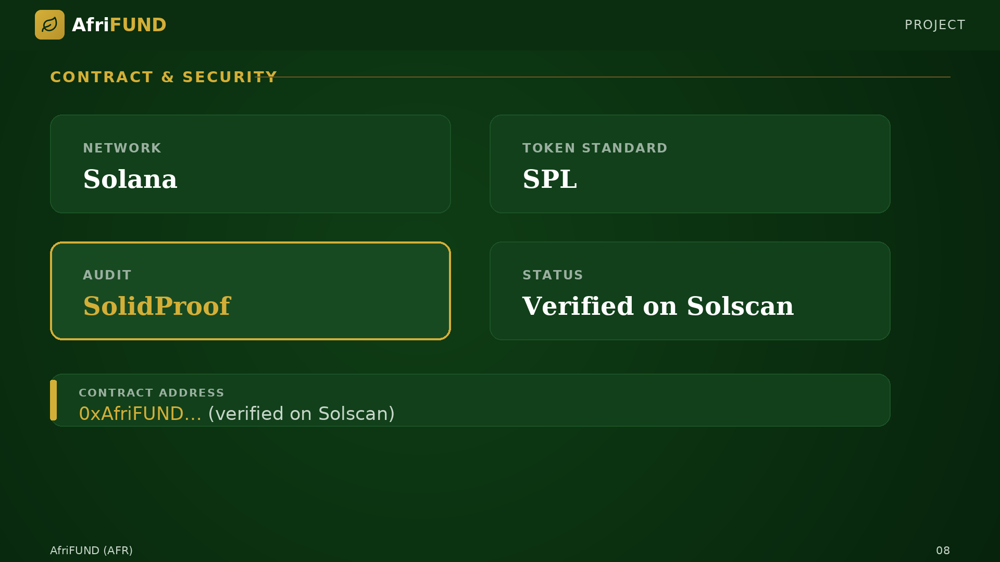

# Contract & Security

The AFR token is implemented as a **standard SPL token on Solana**. Its smart
contract has been independently audited by **SolidProof**, confirming no critical
vulnerabilities and correct minting logic. The contract address is verified on
**Solscan**, allowing anyone to inspect the code and transaction history.

* **Network:** Solana
* **Token standard:** SPL
* **Audit:** SolidProof — no critical vulnerabilities, minting logic verified
* **Contract address:** `0xAfriFUND…` (verified on Solscan)

