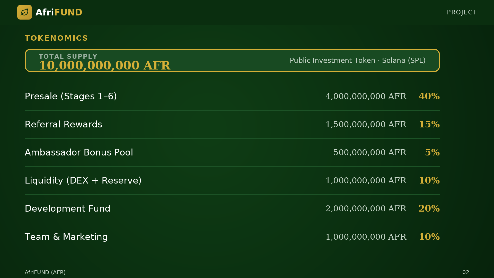

# Total Supply & Distribution

**Total Supply: 10,000,000,000 AFR** · Public Investment Token · Solana (SPL)

The token supply is split into strategic categories. The largest portion is
allocated to the public presale (40%), followed by the development fund (20%),
referral rewards (15%), liquidity reserve (10%), team & marketing (10%), and the
ambassador bonus pool (5%). This structure ensures long-term project
sustainability and incentivises community growth.

| Allocation | Amount | Share |
| --- | --- | --- |
| Presale (Stages 1–6) | 4,000,000,000 AFR | 40% |
| Development Fund | 2,000,000,000 AFR | 20% |
| Referral Rewards | 1,500,000,000 AFR | 15% |
| Liquidity (DEX + Reserve) | 1,000,000,000 AFR | 10% |
| Team & Marketing | 1,000,000,000 AFR | 10% |
| Ambassador Bonus Pool | 500,000,000 AFR | 5% |

