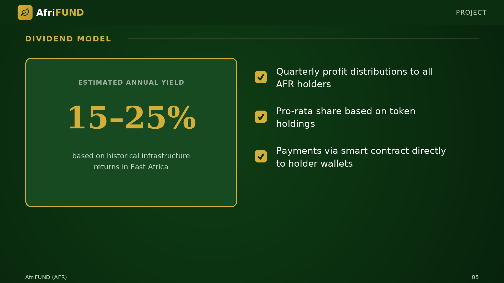

# Dividend Model

AFR holders receive **quarterly dividends** derived from the profits of the
infrastructure projects. Dividends are distributed pro-rata based on token
holdings. Based on historical returns from similar projects in East Africa, the
estimated annual yield ranges from **15% to 25%**. Payouts are executed
automatically via smart contract in SOL.

