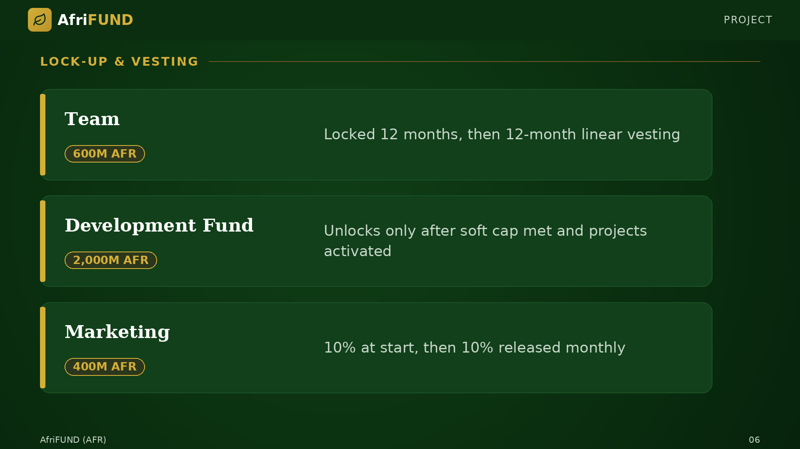

# Lock-up & Vesting

Team tokens (600M AFR) are locked for 12 months and then vest linearly over
another 12 months. The Development Fund (2B AFR) cannot be touched until the soft
cap is reached and projects are activated. Marketing tokens (400M AFR) follow a
monthly release schedule. These measures prevent sudden sell pressure and align
long-term interests.

| Allocation | Amount | Schedule |
| --- | --- | --- |
| Team | 600M AFR | Locked 12 months, then 12-month linear vesting |
| Development Fund | 2,000M AFR | Unlocks only after soft cap met and projects activated |
| Marketing | 400M AFR | Monthly release schedule |

