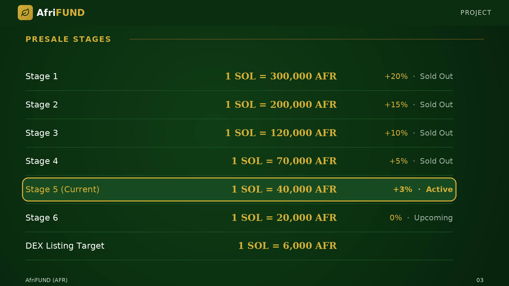

# Presale Stages

The presale is conducted in six stages, each offering a different rate of AFR per
SOL. Stage 1 offered 300,000 AFR per SOL (+20% bonus) and is fully sold out. The
current stage (Stage 5) provides 40,000 AFR per SOL with a 3% bonus. Stage 6 will
offer 20,000 AFR per SOL with no bonus. The presale concludes with a DEX listing
target of 6,000 AFR per SOL, rewarding early participants.

