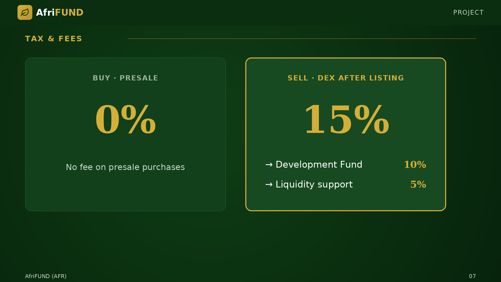

# Tax & Fees

Purchases during the presale carry **zero fees**. When trading begins on Raydium
after the presale, a **15% sell fee** will apply — 10% is directed back to the
Development Fund and 5% supports ongoing liquidity. This fee structure protects
holders by discouraging short-term speculation and ensuring continuous funding
for real assets.

