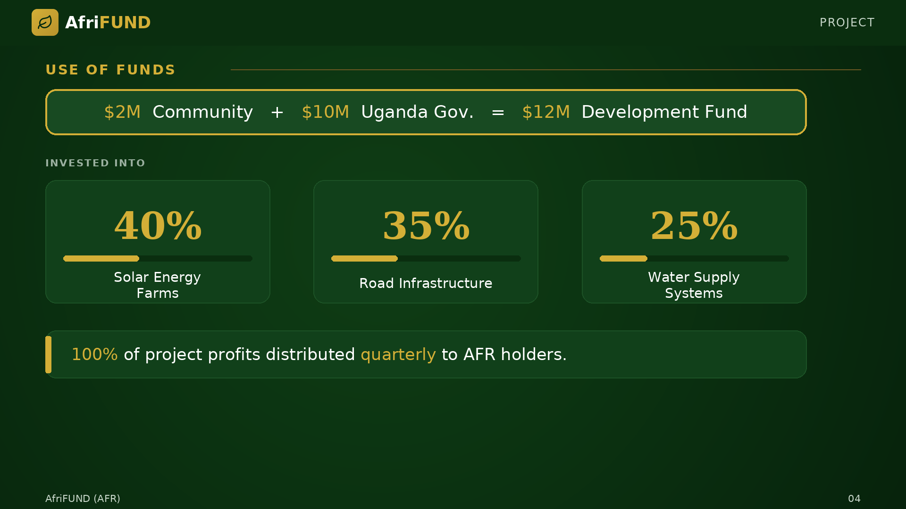

# Use of Funds

Once the **$2M community soft cap** is met, the Ugandan government will contribute
**$10M**, forming a **$12M Development Fund**. These funds are allocated entirely
to tangible infrastructure. All project expenditures are publicly reported and
subject to community oversight.

* **Solar energy farms** — 40%
* **Road construction** — 35%
* **Water supply systems** — 25%

> 100% of project profits are distributed **quarterly** to AFR holders.

